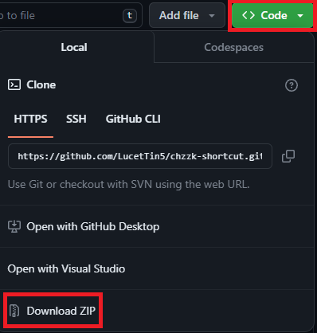

## 네이버 인터넷 방송 플랫폼 Chzzk(치지직) 비디오 단축키 확장 프로그램
치지직에서 비디오에 단축키를 추가하는 크롬 확장 프로그램입니다.

## 확장 프로그램을 설치 방법

1. 위의 이미지에서 <>Code 버튼을 누른다.
2. Download ZIP을 누른다.
3. 크롬 브라우저 주소창에 `chrome://extensions`를 입력한다. 그리고 나서 액세스 허용 창에서 허용을 누른다.
4. 토글 버튼을 개발자 모드로 변경한다.
5. `압축해제된 확장 프로그램을 로드합니다.` 버튼을 누르고 새로 만든 확장 프로그램이 든 디렉토리를 선택한다.

## 기능
비디오 플레이어에 포커스가 있을 때만 단축키가 작동합니다.
* k : 비디오 일시정지/재생
* m : 음소거/음소거 해제
* t : 영화모드/일반모드
* f : 전체화면/전체화면 해제

### 업데이트 내역
* 1.1 첫 배포 버전
* 1.2 방송 페이지 접근 시 자동으로 비디오에 포커스가 가도록 수정
  * 전역변수 제거
  * 코드 최적화 및 가독성 향상
* 1.3 PIP모드에서도 동작하도록 도메인 범위를 변경(/live => /*)
  * 조합키로는 동작하지 않도록 수정(ctrl + f 등 방지)
  * 좌측 nav에서 동작하도록 수정
* 1.4 비디오 컨트롤러에 단축키 표기
  * ex)재생(k), 음소거(m)
* 1.5 광고 스킵 & 단축키 추가
  * 페이지 접근시 자동으로 스킵합니다.
  * 추가된 단축키 목록
  * s: 광고 즉시 스킵
  * i: PIP 모드
  * \\: 채팅창 포커스
  * /: 검색창 포커스
